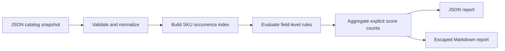

# Architecture

## Boundaries

`src/audit.mjs` contains a pure audit engine and Markdown renderer. `src/cli.mjs` owns argument parsing, local file I/O, output selection, and exit codes. The engine never reads files, fetches images, contacts a service, or mutates the supplied object.

Normalization rejects ambiguous identity and malformed types before scoring. A separate index counts SKU occurrences across the complete supplied dataset, including duplicate SKUs within one product. Runtime is linear in input text size and number of products, images, and variants. Memory use is linear in the normalized snapshot and generated report. The CLI caps input at 10 MiB; the library caller is responsible for its own input limits.

## Correctness decisions

- Reports contain no clock-derived fields so fixtures and CI diffs are deterministic.
- All check outcomes, including skipped and informational ones, remain available in JSON.
- Unknown GTIN applicability is represented by an explicit default policy, rather than treating every missing barcode as an error.
- Explicitly incomplete GraphQL connections fail before scoring. Missing pagination metadata cannot establish completeness.
- Markdown escaping prevents product text from becoming raw HTML or Markdown links in reports. The report itself should still be handled with the confidentiality of its input data.

## Validation coverage

The test suite exercises export normalization, incomplete pages, GTIN check digits, missing fields, duplicate SKUs, invalid prices, HTML description heuristics, untrusted report text, deterministic scoring, input immutability, CLI gates, and safe output handling.

Tests use synthetic catalog records. No live store or customer data is needed. The GitHub Actions workflow runs the same suite on Node.js 22 and 24. A live Shopify integration and hosted UI are intentionally outside version 0.1.0.
